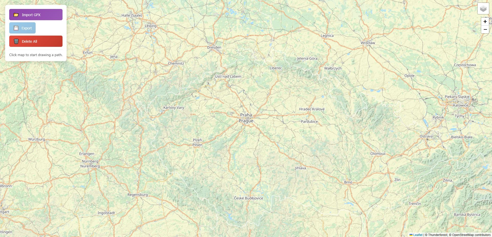

# Mission Planner

## Simple Path Drawer Application

### Basics and controls



This is a Simple Path Drawer application. It has been created for a real-time robot navigation on a virtually set path on a map.

Its controls do as listed:
- Left-click on the map creates a Marker (green = start, red = end)
- Right-click on a Marker shows context menu
- Markers are draggable
- Two or more Markers makes a Path represented by a line
- Clicking on a line modifies the Path by adding a Marker in between its points
- Import GPX button imports a Path from GPX file
- Export button exports current Path to GPX file
- Delete All button deletes all object on the map

## Installation

### Install the dependencies

We recommend using a virtual environment or conda environment to manage dependencies.

Dependencies are listed in `requirements.txt`. You can install them using pip:

```bash
pip install -r requirements.txt
```

### Run the application

To locally run the application, execute the following command in your terminal:

```bash
python app.py
```

To connect to the application, open your web browser and navigate to: `http://localhost:5000` if you did not change the default port. If you encounter any issues, check the terminal for the provided URL.
